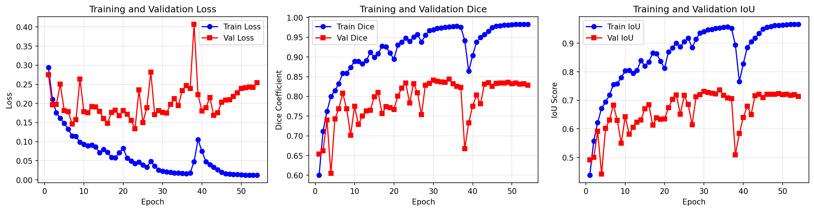
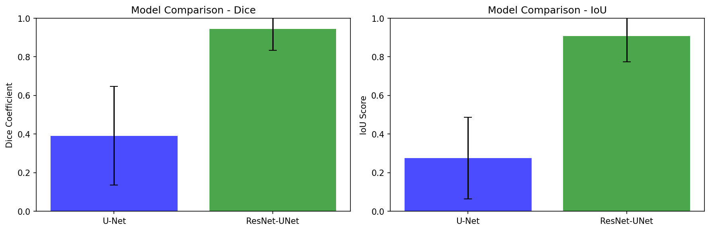
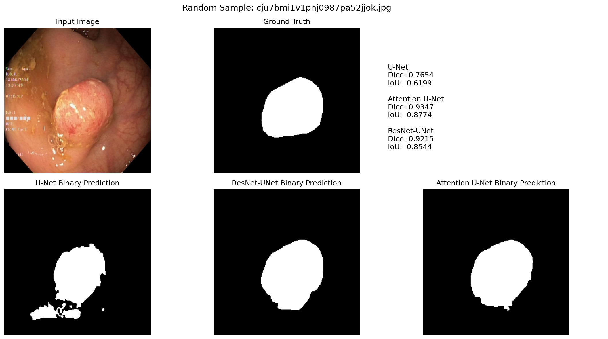

# Medical Image Segmentation with U-Nets

This repository includes a complete implementation of medical image segmentation for gastrointestinal polyps using deep learning. This project includes U-Net, Attention U-Net, and ResNet-UNet models trained on the Kvasir-SEG dataset.

**Dataset:** Kvasir-SEG dataset containing 1000 colonoscopy images with corresponding ground-truth segmentation masks. The dataset comes from [here](https://datasets.simula.no/kvasir-seg/)

## Setting Up the Environment

After cloning/downloading the repository, create a virtual environment and install dependencies:

### MacOS/Linux
```bash
python -m venv venv
source venv/bin/activate
pip install -r requirements.txt
```

### Windows
```bash
python -m venv venv
venv\Scripts\activate
pip install -r requirements.txt
```
Then, download the `data`, `data_separated`, and `checkpoints` folders from this Google Drive [link](https://drive.google.com/drive/folders/1Bwbz3EF7SkfZXx2IWcrFn4K9Q35p75H4) and place them in the root of the project directory. 

`data` includes 2 subfolders - `images` and `masks` - with 950 colonoscopy images and their corresponding segmentation masks. These images are used for training and validation.

`data_separated` includes 2 subfolders - `images` and `masks` - with 50 testing images and masks. These images are used for testing and evaluation of the trained models. These images were held out from the training process to provide an unbiased evaluation of model performance.

`checkpoints` includes the saved model weights for the best U-Net, Attention U-Net, and ResNet-UNet models after training.

## Project Structure

After downloading the necessary folders, your project directory should look like this:

```
gi-polyp-ml/
├── data/
│   ├── images/               # Input colonoscopy images for training/validation
│   └── masks/                # Ground-truth segmentation masks for training/validation
├── data_separated/
│   ├── images/               # Held-out test images
│   └── masks/                # Held-out test masks
├── checkpoints/              # Saved model weights
├── evaluate.py               # Model evaluation on dataset
├── evaluate_all_models.py    # Compare all models
├── experiment.py             # Full pipeline to train/evaluate all models
├── models.py                 # All model architectures
├── random_image_sample.py    # Random image sample visual comparison
├── utils.py                  # Data loading, preprocessing, metrics
├── train.py                  # Training loop and trainer class
├── requirements.txt          # Python dependencies
└── README.md                 # This file
```


## Usage 

After setting up the environment and downloading the dataset, you can train the models, evaluate them, and visualize predictions using the provided scripts. The project supports both command-line interface and Python API for flexibility.

### Training Script

To run the entire training pipeline for all models, use:
```bash
python experiment.py
```

This will train the U-Net, Attention U-Net, and ResNet-UNet models sequentially with the images in `data/`, saving the best model to `./checkpoints/`. It will also generate training curves, CSV files, and comparison plots in the `./results/` folder.

On an Apple Silicon M4 Pro with 24GB RAM, this script took approximately 6 hours to run.

An example of a training curve plot generated by `experiment.py` looks like this:




The model comparison plot generated by `experiment.py` looks like this:



### Inference Scripts

To evaluate the trained models on the held-out test set in `data_separated/`, use:
```bash
python evaluate_all_models.py
```

This will compute Dice and IoU scores for each model on the 50 test images and save a CSV file to `./results/` with metrics such as average Dice and IoU over the test set, for each model. 

To evaluate on a different dataset, you can optionally specify the image and mask directories:
```bash
python evaluate_all_models.py --image-dir ./path/to/test/images --mask-dir ./path/to/test/masks
```


To visualize predictions on a single random image from the test set, use:
```bash
python random_image_sample.py
```

This will randomly select one image from the `data_separated/` folder, run inference with all three models, and print the Dice and IoU scores for that image. It will also generate a side-by-side visualization of the input image, predicted masks for each model, and ground-truth mask.

To save the visualization to a file, you can specify an output path to save the image:
```bash
python random_image_sample.py --output-path ./results/sample_prediction.png
```

To change the input image and mask directories, you can specify them as well:
```bash
python random_image_sample.py --image-dir ./path/to/test/images --mask-dir ./path/to/test/masks
```

An example output visualization from `random_image_sample.py` looks like this:



